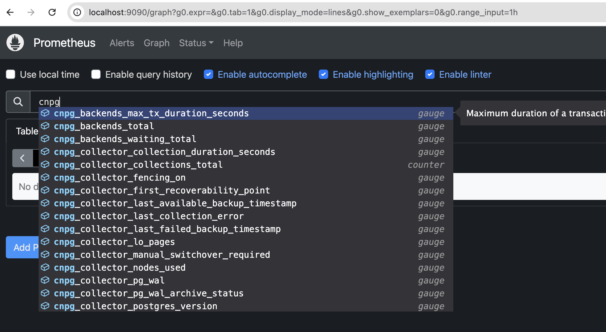
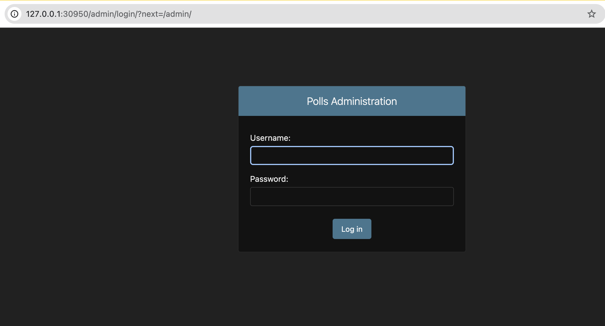

# Django Tutorial Polls App in kind with cloud native pg

This repository contains code for deploying Django polls App in Kind using cloud native pg as backend to provide high availability

- `http://HOST:PORT` will route to polls page
- `http://HOST:PORT/admin` will route to admin page where polls can be created by admin

## Pre req

- Installed softwares
  - Docker
  - Kind
  - Python
    - Install `psycopy2` and `Django`
  - kubectl
  - Helm
  - Clone of this repo

## Step by Step process to deploy this application in kind

### Configuring kind

- As we will try to access the webpage via `127.0.0.1` we need to create a `NodePort` service for the Web app and expose it in the kind configuration as specified in `kind/kind-cluster.yaml`
- Use `kind create cluster --config=kind/kind-cluster.yaml --name mykindcluster` to create custom kind cluster
- Example output

```
kind create cluster --config=kind/kind-cluster.yaml --name mykindcluster
Creating cluster "mykindcluster" ...
 ✓ Ensuring node image (kindest/node:v1.31.0) 🖼
 ✓ Preparing nodes 📦
 ✓ Writing configuration 📜
 ✓ Starting control-plane 🕹️
 ✓ Installing CNI 🔌
 ✓ Installing StorageClass 💾
Set kubectl context to "kind-mykindcluster"
You can now use your cluster with:

kubectl cluster-info --context kind-mykindcluster

Have a nice day! 👋
```

### Installing CloudNativePG

- [CloudNativePG](https://cloudnative-pg.io/documentation/1.24/) is an opensource operator designed to manage PostgreSQL workloads in high available manner
- Use the [latest manifes yaml](https://raw.githubusercontent.com/cloudnative-pg/cloudnative-pg/main/releases/cnpg-1.24.0.yaml) as specified in [instructions](https://cloudnative-pg.io/documentation/1.24/installation_upgrade/) to install the operator
  ```
  kubectl apply --server-side -f \
  https://raw.githubusercontent.com/cloudnative-pg/cloudnative-pg/main/releases/cnpg-1.24.0.yaml
  ```
- Before creating the cluster CR, [install prometheus using the instructions](https://cloudnative-pg.io/documentation/1.24/quickstart/#part-4-monitor-clusters-with-prometheus-and-grafana)

  ```
  helm repo add prometheus-community \
  https://prometheus-community.github.io/helm-charts

  helm upgrade --install \
  -f https://raw.githubusercontent.com/cloudnative-pg/cloudnative-pg/main/docs/src/samples/monitoring/kube-stack-config.yaml \
  prometheus-community \
  prometheus-community/kube-prometheus-stack
  ```

- Prepare and install `cluster.yaml` which then will be detected by the operator and it creates the PG database
  ```
  apiVersion: postgresql.cnpg.io/v1
  kind: Cluster
  metadata:
    name: cluster-example
  spec:
    instances: 3
    monitoring:
      enablePodMonitor: true
    storage:
      size: 1Gi
  ```
  - You can observe that we have set `enablePodMonitor: true` so that operator can create `PodMonitor` object which then will be detected by Prometheus to relay the metrics from the PG pod as mentioned at [CloudNativePG instructions](https://cloudnative-pg.io/documentation/1.24/quickstart/#part-4-monitor-clusters-with-prometheus-and-grafana)
  - Install the cluster CR using `kubectl -n cnpg-system create -f cluster.yaml`
- Make sure PG system is working all ok by inspecting pods

  ```
  kubectl get pods -n cnpg-system
  NAME                                       READY   STATUS    RESTARTS   AGE
  cluster-example-1                          1/1     Running   0          4m36s
  cluster-example-2                          1/1     Running   0          4m16s
  cluster-example-3                          1/1     Running   0          3m57s
  cnpg-controller-manager-6d9cf8648f-6zcfp   1/1     Running   0          7m7s
  ```

- Make sure metrics are reaching prometheus
  - Port forward prometheus service and hit the localhost
    ```
    kubectl port-forward svc/prometheus-community-kube-prometheus 9090
    ```
    

### Loading initial schema and data into postgres

- Create database and assign proper roles to custom user (in this example, bob)

  - Exec into postgres primary pod and run the following

    ```
    kubectl -n cnpg-system exec -it $(kubectl get pod -n cnpg-system -l role=primary -o name) -- bash
    ```

    ```
    psql

    CREATE DATABASE polls;
    \c polls;

    CREATE USER bob WITH PASSWORD '<PASSWORD>';
    ALTER ROLE bob SET client_encoding TO 'utf8';
    ALTER ROLE bob SET default_transaction_isolation TO 'read committed';
    ALTER ROLE bob SET timezone TO 'UTC';
    GRANT ALL PRIVILEGES ON DATABASE polls TO bob;
    GRANT ALL ON SCHEMA public TO bob; ## required for PG v15
    ```

  - References:
    - https://docs.djangoproject.com/en/3.2/intro/tutorial02/#database-setup
    - https://www.digitalocean.com/community/tutorials/how-to-build-a-django-and-gunicorn-application-with-docker#step-1-creating-the-postgresql-database-and-user
  - Example run

    ```
    kubectl -n cnpg-system exec -it $(kubectl get pod -n cnpg-system -l role=primary -o name) -- bash
    Defaulted container "postgres" out of: postgres, bootstrap-controller (init)

    postgres@cluster-example-1:/$ psql
    psql (16.4 (Debian 16.4-1.pgdg110+1))
    Type "help" for help.

    postgres=# CREATE DATABASE polls;
      \c polls;
    CREATE DATABASE
    You are now connected to database "polls" as user "postgres".
    polls=# CREATE USER bob WITH PASSWORD 'password';
      ALTER ROLE bob SET client_encoding TO 'utf8';
      ALTER ROLE bob SET default_transaction_isolation TO 'read committed';
      ALTER ROLE bob SET timezone TO 'UTC';
      GRANT ALL PRIVILEGES ON DATABASE polls TO bob;
      GRANT ALL ON SCHEMA public TO bob; ## required for PG v15
    CREATE ROLE
    ALTER ROLE
    ALTER ROLE
    ALTER ROLE
    GRANT
    GRANT
    ```

- Port forward your postgres primary pod to your local laptop and run `python manage.py migrate`

  - This is required so that django application can load basic tables required for the app

  ```
  kubectl -n cnpg-system port-forward $(kubectl get pod -n cnpg-system -l role=primary -o name)  5432:5432
  Forwarding from 127.0.0.1:5432 -> 5432
  Forwarding from [::1]:5432 -> 5432

  Operations to perform:
  Apply all migrations: admin, auth, contenttypes, polls, sessions
  Running migrations:
    Applying contenttypes.0001_initial... OK
    Applying auth.0001_initial... OK
    Applying admin.0001_initial... OK
    Applying admin.0002_logentry_remove_auto_add... OK
    Applying admin.0003_logentry_add_action_flag_choices... OK
    Applying contenttypes.0002_remove_content_type_name... OK
    Applying auth.0002_alter_permission_name_max_length... OK
    Applying auth.0003_alter_user_email_max_length... OK
    Applying auth.0004_alter_user_username_opts... OK
    Applying auth.0005_alter_user_last_login_null... OK
    Applying auth.0006_require_contenttypes_0002... OK
    Applying auth.0007_alter_validators_add_error_messages... OK
    Applying auth.0008_alter_user_username_max_length... OK
    Applying auth.0009_alter_user_last_name_max_length... OK
    Applying auth.0010_alter_group_name_max_length... OK
    Applying auth.0011_update_proxy_permissions... OK
    Applying auth.0012_alter_user_first_name_max_length... OK
    Applying polls.0001_initial... OK
    Applying sessions.0001_initial... OK
  ```

- This Django Polls App needs at least an admin user to be able to create/update/delete polls,and it is usually done via an interactive console like [this](https://docs.djangoproject.com/en/3.2/intro/tutorial02/#creating-an-admin-user). You can use the following code to script the user creation:
  - Start python shell `python manage.py shell`
  - Run the following script (password is hardcoded for POC purposes)
    ```
    from django.contrib.auth import get_user_model
    User = get_user_model()
    User.objects.filter(email='admin@example.com').delete()
    User.objects.create_superuser('admin', 'admin@example.com', 'admin')
    ```
  - Example run
    ```
    python3 manage.py shell
    Python 3.9.6 (default, Feb  3 2024, 15:58:27)
    [Clang 15.0.0 (clang-1500.3.9.4)] on darwin
    Type "help", "copyright", "credits" or "license" for more information.
    (InteractiveConsole)
    >>> from django.contrib.auth import get_user_model
    >>> User = get_user_model()
    >>> User.objects.filter(email='admin@example.com').delete()
    (0, {})
    >>> User.objects.create_superuser('admin', 'admin@example.com', 'admin')
    <User: admin>
    >>>
    ```

### Installing the Django application

- Build the docker image `dockerfile.prod`
  ```
  docker build -f dockerfile.prod -t polls .
  ```
- Load the image into kind cluster
  ```
  kind load docker-image polls:latest --name mykindcluster
  ```
- Prepare env file and fill the fields which will then be used to create a k8s secret

  ```
  DJANGO_SECRET_KEY='<unique secret key for Django application>'
  DATABASE_NAME=polls
  DATABASE_USERNAME=<DB_USER_NAME>
  DATABASE_PASSWORD=<PWD>
  DATABASE_HOST=<SERVICE_NAME_FOR PG>
  DATABASE_PORT=5432
  ```

  - Database service can be found by running `kubectl get svc -n cnpg-system`
  - We can use `rw` service which will then allow our application to write and read the service, so in below example, we can pick `cluster-example-rw`
    ```
    kubectl get svc -n cnpg-system
    NAME                   TYPE        CLUSTER-IP      EXTERNAL-IP   PORT(S)    AGE
    cluster-example-r      ClusterIP   10.96.91.13     <none>        5432/TCP   38m
    cluster-example-ro     ClusterIP   10.96.213.215   <none>        5432/TCP   38m
    cluster-example-rw     ClusterIP   10.96.65.104    <none>        5432/TCP   38m
    cnpg-webhook-service   ClusterIP   10.96.11.150    <none>        443/TCP    40m
    ```

- Create a k8s secret by using the above prepared env file
  ```
  kubectl -n cnpg-system create secret generic polls-secret --from-env-file=mysecretenv
  ```
- Replace the `docker-image` value with your built docker image at `k8s-templates/deployment.yaml` and install the deployment
  ```
  kubectl apply -f k8s-templates/deployment.yaml -n cnpg-system
  ```
- Now create the service of type `NodePort` which uses the custom port we exposed when creating the kind cluster in `nodePort` field
  ```
  kubectl apply -f k8s-templates/service.yaml -n cnpg-system
  ```
  ```
   polls                  NodePort    10.96.72.199    <none>        8000:30950/TCP   32s
  ```
- In above case we need to use `30950` as our port when testing the application

### Testing the application

- Now that we have exposed nodePort, we can try hitting `http://127.0.0.1:30950` and `http://127.0.0.1:30950`




